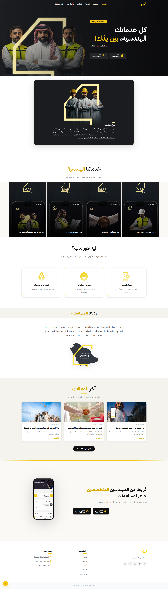
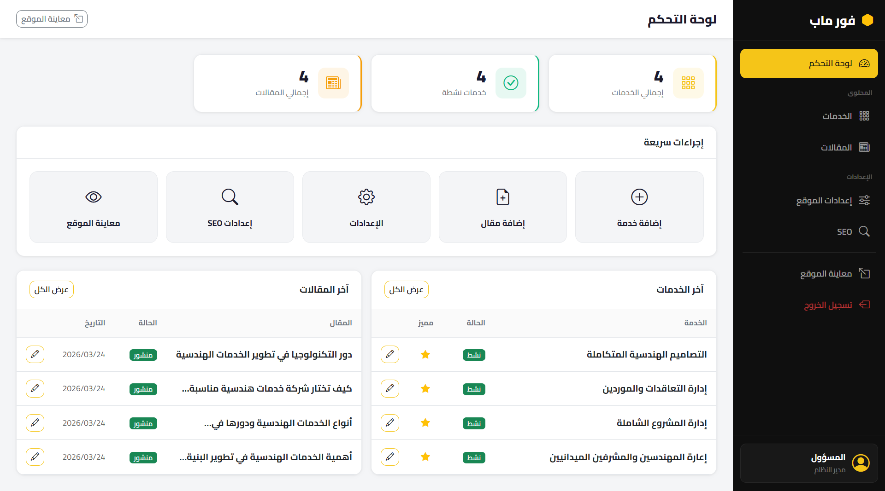
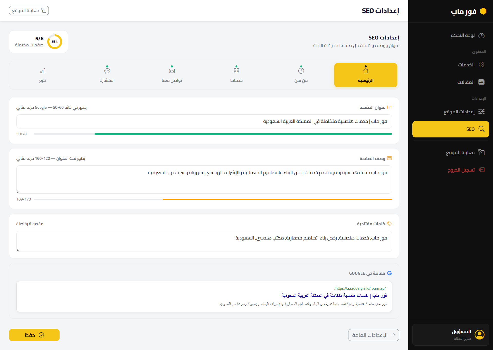
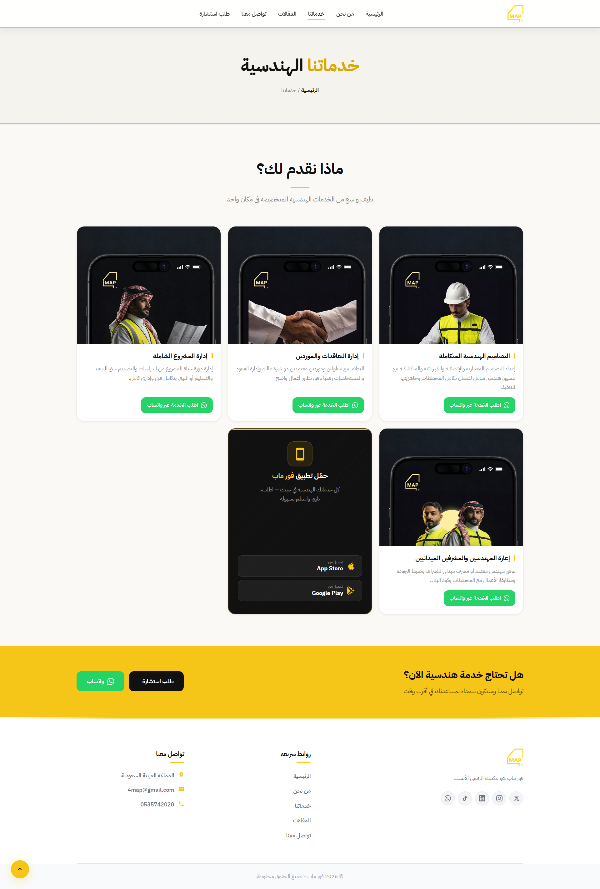

# Fourmap — Arabic Business Website with Custom Admin Dashboard

Fourmap is an Arabic business website built for a Saudi client using **PHP** and **MySQL**.

The project includes a public RTL website, dynamic services and articles pages, consultation and contact pages, email-based contact handling, SEO settings, image uploads, and a custom admin dashboard for managing website content.

## Live Demo

[View Website](https://kaghim.wuaze.com)

---

## Screenshots

| Home Page | Admin Dashboard |
|---|---|
|  |  |

| SEO Settings | Services Page |
|---|---|
|  |  |

---

## Overview

Fourmap is a business website created to present engineering services in Arabic for a Saudi client.

The website provides a clean RTL user experience and includes pages for home, about, services, articles, consultation request, and contact. The project also includes a custom admin dashboard that allows the website owner to manage dynamic content without editing code.

---

## Key Features

- Arabic RTL website
- PHP and MySQL backend
- Public business website pages
- Home page
- About page
- Services page
- Articles page
- Article details page
- Consultation page
- Contact page
- Contact form email handling
- Custom admin dashboard
- Admin login/authentication
- Dashboard statistics
- Services management
- Articles management
- Partners management
- Accreditations management
- Website settings management
- SEO settings for pages
- Image uploads
- Sitemap
- Robots.txt
- Custom 404 page
- Responsive layout

---

## Admin Dashboard

The custom admin dashboard allows the website owner to manage the main content of the website through a simple interface.

Admin features include:

- Dashboard overview
- Services create/edit
- Articles create/edit
- Website settings
- SEO settings
- Partners management
- Accreditations management
- Image uploads
- Website preview

---

## SEO Management

The project includes SEO settings for important website pages, including:

- Home page
- About page
- Services page
- Contact page
- Consultation page

Each page can have SEO-related content such as page title, meta description, and keywords.

---

## Tech Stack

- PHP
- MySQL
- HTML
- CSS
- JavaScript
- Bootstrap
- PDO
- Custom Admin Dashboard
- RTL Arabic UI

---

## Project Structure

```txt
fourmap
├─ .htaccess
├─ 404.php
├─ about.php
├─ admin
│  ├─ accreditations.php
│  ├─ article-create.php
│  ├─ article-edit.php
│  ├─ articles.php
│  ├─ auth.php
│  ├─ config.php
│  ├─ dashboard.php
│  ├─ login.php
│  ├─ logout.php
│  ├─ partials
│  │  ├─ footer.php
│  │  ├─ header.php
│  │  └─ sidebar.php
│  ├─ partners.php
│  ├─ seo.php
│  ├─ service-create.php
│  ├─ service-edit.php
│  ├─ services.php
│  └─ settings.php
├─ article.php
├─ articles.php
├─ assets
│  ├─ css
│  │  ├─ admin.css
│  │  └─ style.css
│  ├─ images
│  ├─ js
│  │  ├─ admin.js
│  │  └─ main.js
│  └─ uploads
├─ consultation.php
├─ contact-submit.php
├─ contact.php
├─ database
│  └─ fourmap_db.sql
├─ includes
│  ├─ db.php
│  ├─ footer.php
│  ├─ header.php
│  └─ settings.php
├─ index.php
├─ robots.txt
├─ services.php
├─ sitemap.php
└─ uploads
```

---

## Local Setup

### 1. Clone the repository

```bash
git clone https://github.com/Karrim0/fourmap-website.git
cd fourmap-website
```

### 2. Move project to your local server directory

For XAMPP, place the project inside:

```txt
C:\xampp\htdocs\fourmap
```

### 3. Create the database

Create a MySQL database named:

```txt
fourmap_db
```

### 4. Import database

Import the SQL file:

```txt
database/fourmap_db.sql
```

using phpMyAdmin.

### 5. Configure database connection

Update the database connection file:

```txt
includes/db.php
```

Example local configuration:

```php
<?php
$host = "127.0.0.1";
$dbname = "fourmap_db";
$username = "root";
$password = "";
$port = "3307";

try {
    $pdo = new PDO(
        "mysql:host=$host;port=$port;dbname=$dbname;charset=utf8mb4",
        $username,
        $password
    );

    $pdo->setAttribute(PDO::ATTR_ERRMODE, PDO::ERRMODE_EXCEPTION);
    $pdo->setAttribute(PDO::ATTR_DEFAULT_FETCH_MODE, PDO::FETCH_ASSOC);

} catch (PDOException $e) {
    die("Database connection failed");
}
```

### 6. Run the project

Open:

```txt
http://localhost/fourmap
```

Admin panel:

```txt
http://localhost/fourmap/admin/login.php
```

---

## Deployment

The live demo is hosted on a free PHP/MySQL hosting environment.

For deployment:

1. Upload project files to the hosting `htdocs` or `public_html` directory.
2. Create a MySQL database.
3. Import `database/fourmap_db.sql`.
4. Update `includes/db.php` with hosting database credentials.
5. Test the public website and admin dashboard.

> Do not commit real hosting credentials to GitHub.

---

## My Role

I built Fourmap as a PHP/MySQL business website based on client requirements.  
My work included the public website pages, RTL Arabic layout, services and articles modules, contact form handling, database integration, SEO settings, image uploads, and the custom admin dashboard.

---

## Status

Live demo available.  
Client project / business website.

---

## Author

Built by **Kareem Mohamed Hanafy**.

GitHub: [Karrim0](https://github.com/Karrim0)
